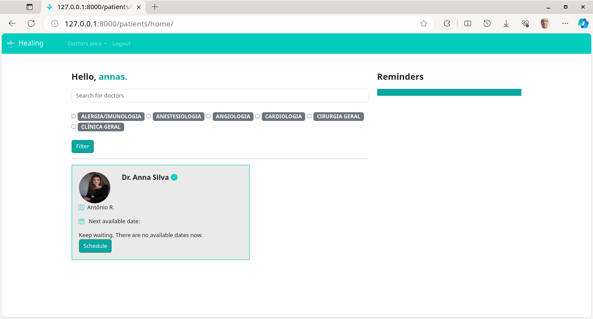
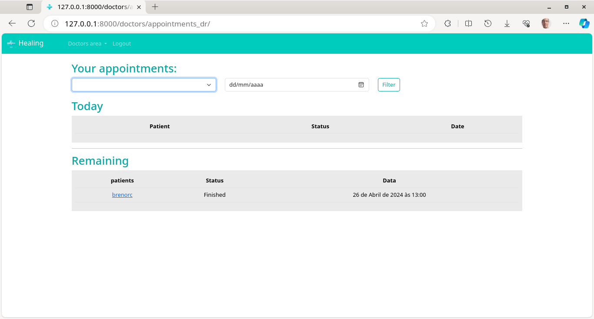
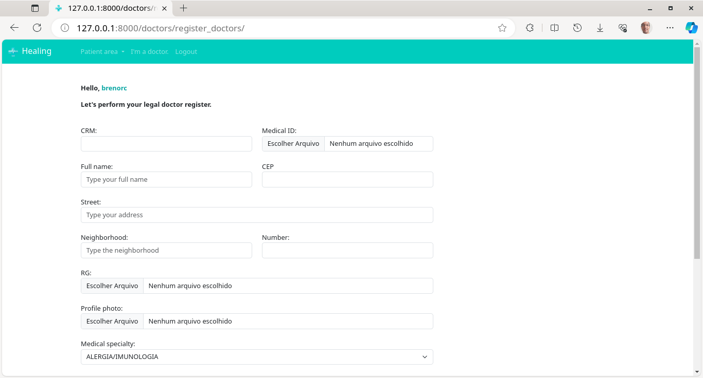

### Olá 👋, sou Breno, um desenvolvedor e analista de testes de *software/ QA Analyst*. 

## Minhas habilidades: 

- Selenium

### SO's: 

Formado em Ciência da Computação, com sólida base técnica e experiência em suporte técnico e infraestrutura de TI, com atuação predominante como analista de Service Desk. Ao longo desta trajetória, desenvolvi habilidades de análise, diagnóstico de falhas e atendimento técnico em massa, e suporte a sistemas, tanto de hardware como software, em diversos cenários e  análise de software e hardware. 
Como analista de QA, atuo com testes automatizados, utilizando ferramentas como Selenium, Cypress e Postman integradas a linguagens como JS e Python. Possuo conhecimento prático em ambientes Windows e Linux, bancos de dados SQL e NoSQL, integração de API's.
Reconhecido pela abordagem analítica e comunicação assertiva em ambientes colaborativos, busco oportunidade para aplicar minha versatilidade técnica com foco em qualidade para agregar valores a equipes ágeis, entregando software estável, escalável e livre de defeitos.

## Projetos:
- HealingAPP: Um webAPP voltado para o gerenciamento de consultas para clínicas com muitos recursos como gerenciamento inteligente de agenda, feito com Python e Django:
[Acesse aqui](https://brenorcunha.pythonanywhere.com/)

##Testes: 
Meus scripts de teste você encontra [aqui](https://github.com/brenorcunha/AutomatedTests)
